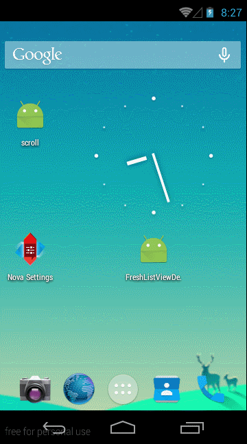

###本框架实现了ListView的下拉刷新,加载更多的功能
* 本lib包适用于Android Studio

###示意图:

### 回调数据接口
#### 实现数据的刷新和加载实现接口
		//监听回调
        listView.setOnRefreshDataLister(new FreshListView.OnRefreshDataLister() {
            @Override
            public void freshData() {
                //测试数据
                mHandler.sendMessageDelayed(mHandler.obtainMessage(), 2000);
            }

            @Override
            public void loadMoreData() {
                //测试数据
                mHandler.sendMessageDelayed(mHandler.obtainMessage(), 2000);
            }
        });
### 实现功能
####由于本框架的下拉刷新view,已经使用了ListView
		addHeaderView(headRoot);
		addFooterView(footRoot);

所以提供了添加view的功能方法

	/**
     * 添加View的功能
     *
     * @param view
     */
    public void addViewPagerView(View view) {

        this.view = view;
        //添加view控件到linearlayout中
        headView.addView(view);
    }
